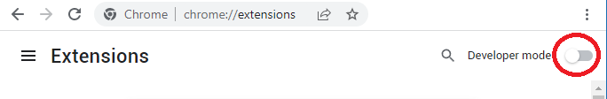
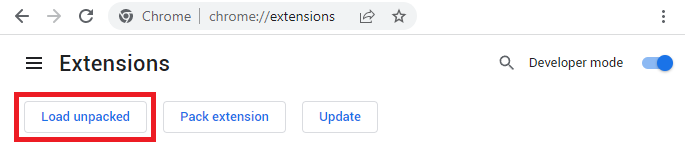
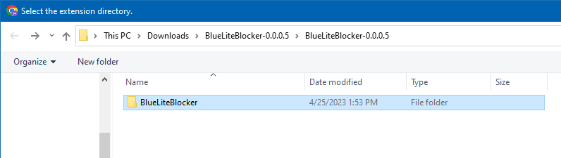
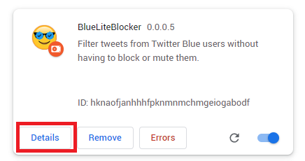
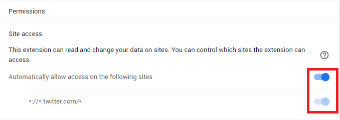
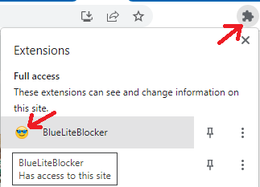

~~# Installing from source (Chrome)

## Downloading & extracting

Download the latest zip from the [release page](https://github.com/MalwareTech/BlueLiteBlocker/releases)

Extract to wherever you want.

## Loading extensions via developer mode

Navigate to [chrome://extensions](chrome://extensions) in the browser address bar

Enable "Developer mode" by clicking the sliding button.

Next click "Load unpacked"

Navigate to wherever you extracted the extension and look for the `BlueLiteBlocker` folder inside

Make sure to select the `BlueLiteBlocker` folder, not `BlueLightBlocker-<version-num>`

### Enabling required permissions
Click the "Details" button on the BlueLiteBlock extension widget

Ensure the `*://*.twitter.com/*` permission is enabled (blue)

## Configure the settings
If you wish to change any settings, simply navigate to twitter.com and click the puzzle icon in to top right corner, followed by the extension icon.

This will open the configuration page.

## All done!