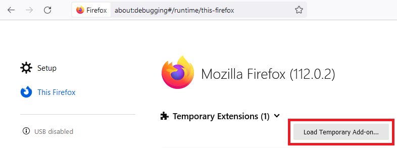
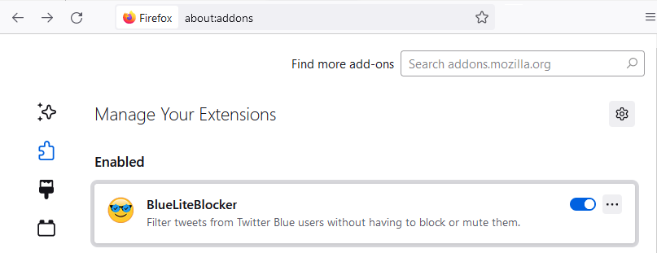
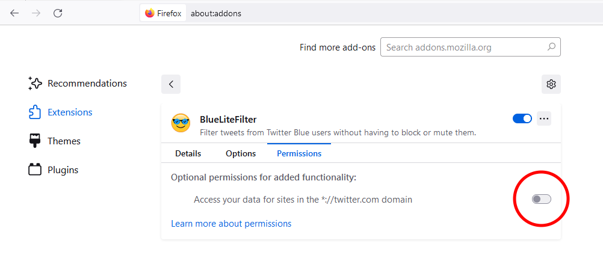
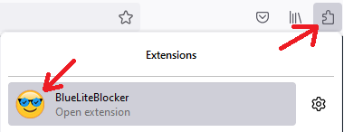

# Installing from source (Firefox)

### Downloading & extracting

Download the latest zip from the [release page](https://github.com/MalwareTech/BlueLiteBlocker/releases)

Extract to wherever you want.

### Loading extensions via developer mode

Navigate to [about:debugging#/runtime/this-firefox](about:debugging#/runtime/this-firefox) in the browser address bar

click "Load Temporary Add-on..."

Navigate to wherever you extracted the extension and look for the `BlueLiteBlocker` folder inside

select `manifest.json` and click open

### Enabling required permissions
Navigate to [about:addons](aabout:addons) in the browser address bar

click on the BlueLiteBlocker extension

Ensure the `*://twitter.com/` permission is enabled (blue)

### Configure the settings
If you wish to change any settings, simply navigate to twitter.com and click the puzzle icon in to top right corner, followed by the extension icon.

This will open the configuration page.

### All done!