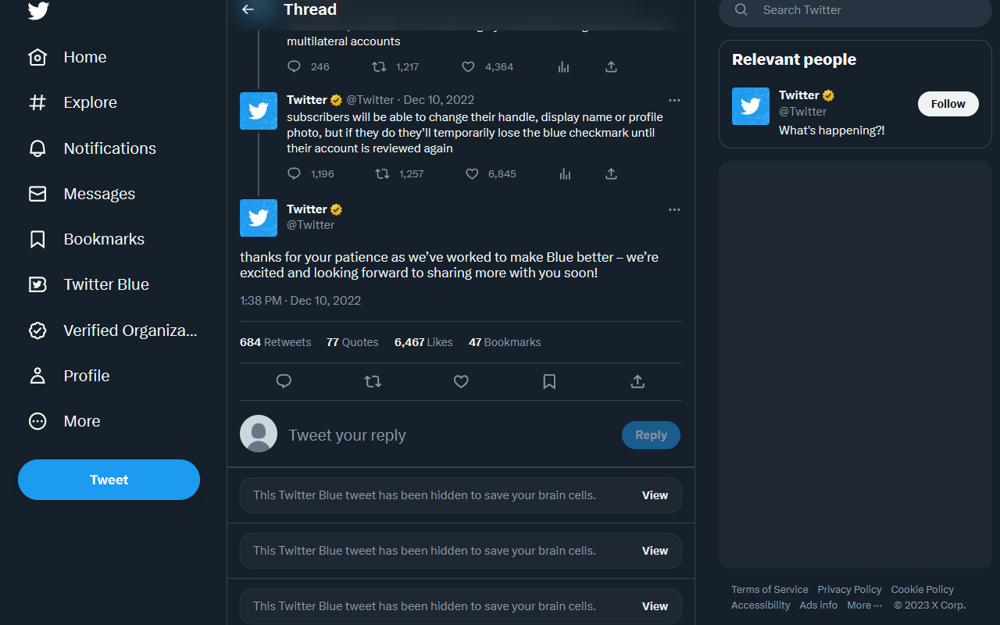

#  BlueLiteBlocker (v0.0.0.9)

**Blue Checks are known to the state of California to cause eye damage and reproductive harm.**

### About
This extension allows you to hide Tweets from Twitter Blue users you don't follow, if they have less than a set number of followers.
You can customize the follower threshold and choose between collapsing or removing Tweets. 

**Currently Supports**: FireFox, Chrome
### Release Builds
**Note:** the WebStore take a while to approve extension updates. If the store version doesn't match the GitHub version, consider installing from [source](#How-To-Install-From-Source) instead.

**[How to install from source](#How-To-Install-From-Source)**

| Latest Release | Release Version                                                                                        |
|----------------|--------------------------------------------------------------------------------------------------------|
| Source Code    | [v0.0.0.9](https://github.com/MalwareTech/BlueLiteBlocker/archive/refs/tags/v0.0.0.9.zip)              |
| Chrome Store   | [v0.0.0.9](https://chrome.google.com/webstore/detail/blueliteblocker/gimbefnamedicgajjballjjhanhnpjce) |
| Firefox Store  | [v0.0.0.9](https://addons.mozilla.org/en-US/firefox/addon/blueliteblocker/)                            |

[**Demo Video**](https://www.youtube.com/watch?v=nyQomTilJXo)

  
example of Tweet collapsing

### How To Install From Source
Chrome: [chrome_install.md](/Instructions/Chrome/chrome_install.md)

FireFox: [firefox_install.md](/Instructions/Firefox/firefox_install.md)

### How It Works
The extension intercepts HTTP responses from Twitter's API and parses the tweet lists for Twitter Blue users. 

Developing this extension required reverse engineering the Twitter API and client, 
so it may stop working if major changes to the platform are made. Please submit an issue to let me know about any bugs/suggestions.

### Settings
**Note**: this extension will not hide tweets from people you follow regardless of Blue status.

**Follow Threshold** - don't hide Tweets from users with more than X followers (default 100,000).

#### Filtering Modes

**Default** - Tweets from Twitter Blue users will be collapsed in the timeline/replies as seen in the image below. 

Note: this does not work for search/notification, so in those cases the extension will just remove the tweet.

**Hard** - Tweets from Twitter Blue users will never show up in your feed. This is somewhat buggy and needs further
testing.

-- -
### Known Issues
#### Hard Filter Mode
- may hit Twitter rate limit if lots of responses are from Blue users (seems like an API limitation, but may be fixable)
- some issues with feed moving after loading new tweets, may be due to Twitter expecting more Tweets than we show
- 

#### Soft Filter Mode
- no apparent way so collapse Tweets in notifications or search. We currently use hard filtering on these.

## Updates

Follow me on https://infosec.exchange/@malwaretech for updates.
 
